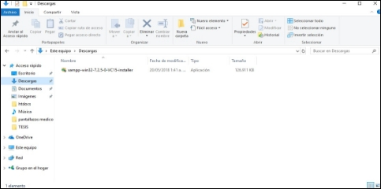
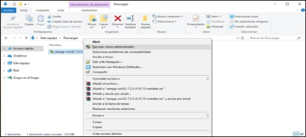

1

# **Manual técnico: Cine Unicah**

Alberto Paz 

Brayan Jose Peña Perez

Douglas Aguilera

Fabiola Molina

María Gonzales

Campus Global, Universidad Católica de Honduras

1601: Seminario-taller de software

Reina Tosta

25 de febrero del año 2024
# **Agradecimientos**
## **Desarrolladores del proyecto**
El siguiente proyecto fue realizado por los alumnos de la Universidad Católica De Honduras (Campus Global), en base a un Cine ficticio. Por el esfuerzo, colaboración para la elaboración del proyecto, se les agradece a los compañeros de grupo:

- José Mario Salgado [0801200117998]
- Jancel Meléndez [1807200201085]
- Gloria Tejeda [0801200301446]
- Daniel Godoy [0801199215880]
- Jorge Paz [1516200300024]

# **Introducción**
Esta versión (Versión 1.0) de la página web de CINE UNICAH destaca por su enfoque en la usabilidad y el rendimiento eficiente. Desde su concepción, se ha trabajado para garantizar un diseño ordenado y legible, aplicando herramientas innovadoras en su desarrollo. Con diseños atractivos y un rendimiento óptimo, la página web se distingue por su interfaz amigable, que facilita la navegación y la gestión de las actividades de los usuarios. Se ha procurado mantener la interfaz simple y sin sobrecargarla de información, evitando así confusiones al usuario. En resumen, esta plataforma ha sido diseñada para agilizar el proceso de compra de tickets y hacer la experiencia del usuario más placentera.

# **Objetivos**
## **Objetivos Generales**
El proyecto tiene como objetivo principal desarrollar una página web para "Cine UNICAH", centrada en brindar una experiencia óptima al usuario. Esta plataforma permitirá a los usuarios interactuar con las diversas opciones de películas, horarios y selección de asientos. Además, posibilitará la compra de boletos de forma virtual, ofreciendo comodidad y accesibilidad desde cualquier dispositivo conectado a internet.
## **Objetivos Específicos**
- Incrementar la demanda del cine al simplificar y hacer más cómoda la adquisición de boletos a través de la página web.
- Establecer comunicación constante con la empresa para presentar y ajustar el diseño del sistema, garantizando la satisfacción de todos los involucrados y corrigiendo cualquier error para lograr un diseño atractivo y funcional.
- Permanecer disponibles para la gerencia de CINE UNICAH, ofreciendo asistencia y clarificación de dudas, así como la posibilidad de incorporar nuevas funcionalidades a la página web según sea necesario.
# **Glosario**
**HTML:** El Lenguaje de Marcado de Hipertexto (HTML) es el código utilizado para estructurar y presentar una página web y su contenido. Puede incluir párrafos, listas con viñetas, imágenes y tablas de datos, entre otros elementos.

**MySQL:** Es un sistema de gestión de bases de datos relacional desarrollado y distribuido por Oracle Corporation bajo una licencia dual: Licencia Pública General/Licencia Comercial. Es una de las bases de datos más utilizadas en el mundo.

**PHP:** Es un lenguaje de programación de propósito general, especialmente adaptado para el desarrollo web. Fue creado por el programador danés-canadiense Rasmus Lerdorf en 1994. La implementación de referencia de PHP es producida por The PHP Group.

**Hipervínculo:** También conocido como enlace o vínculo, es una referencia unidireccional en un documento electrónico que conecta diferentes documentos o secciones entre sí, permitiendo la navegación dentro de un sitio web o entre sitios web.

**JavaScript:** Es un lenguaje de programación interpretado, un dialecto del estándar ECMAScript. Se caracteriza por ser orientado a objetos, basado en prototipos, imperativo, débilmente tipado y dinámico.

**Header:** Se refiere a la información adicional situada al principio de un bloque de información que será almacenado o transmitido. Contiene datos necesarios para el tratamiento adecuado del bloque de información, como metadatos o información de control.

**Footer:** En tipografía y procesamiento de texto, el pie de página de una página impresa es una sección ubicada debajo del texto principal o cuerpo. Por lo general, se utiliza para incluir el número de página, información de derechos de autor u otros detalles relevantes.

**Body:** El elemento <body> de HTML representa el contenido principal de un documento HTML. Es el área visible de la página web donde se muestran los elementos que forman parte del contenido principal. Cada documento HTML puede contener solo un elemento <body>.

# **Justificación y Descripción Detallada de la Tecnología Implementada**
Para el desarrollo de esta página web, se seleccionó una combinación de tecnologías que ofrecen un balance entre funcionalidad, facilidad de uso y familiaridad con el equipo de desarrollo. A continuación, se presenta una descripción detallada de cada una de las tecnologías utilizadas:
## **Editores de código**
### ***Visual Studio Code***
Se seleccionó Visual Studio Code como editor de código principal debido a su versatilidad, facilidad de uso y velocidad.

- Ofrece resaltado de sintaxis, autocompletado de código y una interfaz intuitiva que facilita la escritura y edición de código HTML, CSS y PHP.
- Cuenta con una amplia gama de extensiones que permiten personalizar el entorno de desarrollo y añadir funcionalidades adicionales.
## **Lenguajes de programación**
### ***HTML***
Se utilizó HTML como lenguaje de marcado para definir la estructura y el contenido de la página web. Se optó por HTML5, la última versión del lenguaje, por su mayor flexibilidad y capacidad de adaptación a diferentes dispositivos.
### ***CSS***
Se utilizó CSS para definir la presentación visual de la página web, incluyendo el diseño, la tipografía y el layout. Se utilizó la metodología BEM (Block Element Modifier) para organizar y estructurar las clases CSS, lo que facilita el mantenimiento y la escalabilidad del código.
### ***PHP***
Se utilizó PHP para la gestión de la base de datos y la creación de contenido dinámico. Se utilizó una arquitectura MVC (Modelo-Vista-Controlador) para separar la lógica de la aplicación de la presentación visual.
### ***Javascript***
JavaScript es un lenguaje de programación esencial para el desarrollo de páginas web modernas e interactivas. Se ejecuta en el lado del cliente, es decir, en el navegador web del usuario, lo que permite que las páginas web respondan a las acciones del usuario en tiempo real.
## **Gestor de bases de datos**
### ***MySQL***
Se utilizó MySQL como gestor de bases de datos para almacenar la información del sitio web. Se utilizó una estructura de base de datos optimizada para el tipo de información que se almacena.
## **Servidor web**
### ***XAMPP***
Se utilizó XAMPP como servidor web local para probar y desarrollar la página web antes de su publicación en un servidor online. XAMPP es una solución fácil de usar que incluye Apache, MySQL y PHP, lo que facilita la configuración y el desarrollo de aplicaciones web.

# **Requisitos técnicos de hardware y software**
## **Hardware**
**Procesador:** Intel Core i3 o superior (o equivalente AMD).

**Memoria RAM:** 8 GB o superior.

**Almacenamiento:** El proyecto requiere 50MB para poder trabajar en él, se recomienda que el disco duro no este cerca de su limite para trabajar en condiciones óptimas.

**Tarjeta gráfica:** Gráficos integrados o externos de cualquier nivel.

**Software**

`	`**Servidor:** Servidor local de PHP.

`	`**Base de datos:** MySQL.

**Administrador de base de datos:** Laragon, datagrid, PhpMyAdmin u cualquier otro.

**Sistema operativo:** Sin ningún requerimiento (Windows, MACOS, Linux).

# **Instalación y configuración de requerimientos de desarrollo**
## **Servidor web local (XAMPP) y Servidor de base de datos MySQL**
Es una herramienta para “emular" un servidor en nuestro propio ordenador, de forma local, desarrollada por Apache Friends. Lo que hace XAMPP es instalar un servidor Apache con MySQL como gestor de base de datos, PHP como lenguaje de script del lado del servidor y también cuenta con el lenguaje de programación Perl (en este proyecto no es usado). Gracias a esto, es posible desarrollar el proyecto al completo de manera local, sin necesidad de disponer de servidores remotos. Dicho todo esto nos disponemos a instalar XAMPP en Windows.

Descargamos el archivo de instalación de XAMPP de la página oficial www.apachefriends.org donde podemos encontrar la versión más reciente y para todos los sistemas operativos, aunque en esta ocasión utilizaremos Windows.

Escogemos alguno de los tres sistemas operativos coincidiendo con el sistema operativo que tenemos instalado en nuestro computador, en el caso de los desarrolladores de este proyecto, el sistema operativo es Windows 10 pro de 64 bit.

Una vez descargado el archivo de instalación de XAMPP, generalmente lo encontramos en la carpeta de descargas de cualquier sistema operativo.

Luego de descargar XAMPP ejecutamos el instalador como administrador.

En la imagen se puede observar que se ha iniciado el asistente de instalación en la que procederemos en presionar “Next”.

Seguimos con seleccionar cada uno de los elementos o paquetes que desea instalar, en este caso los seleccionamos todos.

Procedemos en buscar el directorio en el cual va a quedar instalado el programa en este caso “C:\xampp”.

En la anterior pantalla la instalación nos ofrece información sobre los instaladores de aplicaciones para XAMPP creados por Bitnami, presionaremos en el botón “next” para continuar.

Seguimos en confirmar la instalación dando clic en el botón “next”.

Comienzo de la fase de instalación.

Una vez terminado el proceso de instalación continuamos con presionar en el botón “finish”.

Elegimos nuestro idioma de preferencia y presionamos “save”.

Para la muestra de nuestra aplicación se es necesario iniciar los servicios “Apache” y “MySQL”.

Debemos activar los servicios de Apache y MySQL, esto levantara el servidor web de PHP para poder visualizar nuestra página y también levantara el servidor de base de datos MySQL para poder manejar nuestros datos.

Para visitar nuestro administrador de base de datos debemos ir al siguiente enlace <http://localhost/phpmyadmin/> que nos llevara al panel de administración de la base de datos.

Para visualizar nuestra pagina web/proyecto debemos tener en nuestro disco local C una carpeta llamada htdocs, generalmente la ruta es C:\xampp\htdocs y dentro de la carpeta www generalmente se coloca la carpeta contenedora de nuestro proyecto llamada **CineUnicah** que contiene todos los archivos con los que se trabajó el proyecto.

Ahora con la carpeta en nuestro servidor local solo debemos ir a nuestro navegador e ir a la dirección <http://localhost/CineUnicah/PantallaPrincipal.html> y con esto podremos ver nuestra pagina web principal ya renderizada en nuestro nevagador.

# **Base de datos**
## **Creación de la base de datos, estructura de las tablas e inserción de datos**
La base de datos se puede crear con el script encontrado dentro de los archivos del proyecto, el archivo tiene el nombre de “cine\_unicah\_bd.sql” y cuenta con las sentencias SQL para la creación de la base de datos, de las tablas y generación de los datos por defecto usados para el proyecto, basta con ejecutar el script completo de manera secuencial desde la primera línea hasta la última.

## **Estructura y diagrama de la base de datos**
La base de datos cuenta con las siguientes tablas; asientos, categoria\_asientos, clasificacion\_pelicula, contador, datos\_orden, datosusuariofact, detalle\_fact, entradas, factura, formato\_peliculas, funciones, genero, horario, idioma, invitado, isv, pago, pantalla1, películas, producto, reservación, salas, total\_temp, total\_ventas\_diarias, user, usuarios.

# **Mantenimiento de la información**
Para esta parte del manual se necesita conocer un poco sobre como programar o usar las tecnologías antes expuestas y con las que se desarrolló el proyecto.
## **Añadir nuevos combos a la dulcería**
### ***Paso 1:***
Lo primero que debemos hacer es tener abierto nuestro proyecto en nuestro editor de código preferido, para este proyecto se utilizó VsCode y el proyecto abierto se debería ver como la siguiente imagen…

### ***Paso 2:***
Ahora debemos ubicar el archivo llamado ***combos.php*** ubicado en la carpeta principal, no es necesario ingresar a ninguna carpeta para encontrarlo, también podemos ubicar la carpeta llamada ***img*** que es donde pondremos cada imagen que queramos usar.

### ***Paso 3:***
Una vez con el archivo abierto debemos buscar el ***div*** con la clase ***caja*** y podremos ver la siguiente estructura, esta estructura nos servirá para añadir y/o modificar cualquier combo que necesitemos.

Para añadir un nuevo combo solo debemos copiar esta estructura de código y pegarla antes o después de este mismo contenedor de clase caja, en la etiqueta ***h4*** pondríamos el nombre de nuestro combo, en la etiqueta ***h5*** podremos poner de igual manera el precio de nuestro combo, la etiqueta ***img*** nos servirá para mostrar la imagen de nuestro combo y aquí solo necesitamos modificar la ruta o ***src***, esto se modifica dentro de las comillas como puede ser ***“img/imagenNueva.png”*** lo único que cambia es el nombre y se debe añadir la extensión de la imagen… Por último, en la etiqueta ***input*** podremos aumentar o disminuir el máximo de combos que se pueden comprar por transacción de el mismo tipo, eso seria todo para añadir o modificar un combo.
## **Añadir nuevas películas a el apartado de próximamente**
### ***Paso 1:***
Debemos ubicar el archivo llamado ***proximamente.html*** y ubicarnos en el bloque de código que tenga el contenedor ***div*** con la clase ***div\_hijo*** para estar donde se crean y/o editan las películas que estrenaran próximamente

### ***Paso 2:***
Ahora simplemente debemos copiar el siguiente bloque de código completamente para pegarlo antes o después de uno de los bloques de código ya existentes

Para añadir algo nuevo a la cartelera de próximamente bastaría con eso, pero si lo que queremos es editar simplemente debemos modificar la etiqueta ***img*** cambiando el nombre de la imagen que esta en el bloque de código y ponemos el nombre de la que queremos mostrar ahora según sea necesario.
## **Modificar la cartelera de películas**
### ***Paso 1***
Para añadir nuevas películas a la cartelera del cine es relativamente fácil, debemos encontrar el archivo llamado ***cartelera.html***

### ***Paso 2***
Debemos buscar un bloque de código que inicia con un contenedor que tiene por clase ***div\_hijo*** y aquí podremos encontrar toda la estructura que conforma cada objeto de nuestra cartelera.

En la etiqueta ***img*** podremos cambiar la ruta de la imagen, aquí siempre debemos poner el nombre correcto de la imagen junto con su extensión, lo siguiente que importa cambiar es la sinopsis de la película y eso lo hacemos simplemente cambiando en texto dentro del contenedor de clase ***bordered*** y es preciso poner una buena descripción para que se muestre en la pagina web, ahora para modificar o añadir un titulo debemos modificar el texto del contenedor de clase ***NP*** y por ultimo para cambiar o añadir horarios debemos modificar el texto de la etiqueta ***pre*** que esta después del título y además debemos separar cada horario con la etiqueta ***&nbsp***… Esto seria todo para añadir o modificar la cartelera, es el bloque de código completo y además es intuitivo al verlo por uno mismo.
## **Carpetas del proyecto**
Aquí solo explicaremos un poco de cada carpeta que hay en el proyecto

- La carpeta principal y además la carpeta del proyecto se llama ***CINEUNICAH*** y contiene todos los archivos, carpetas que necesita el proyecto para funcionar.
- La carpeta ***CSS*** es donde pondremos los archivos de estilo que creemos para nuestra página, también encontraremos aquí los archivos ya utilizados para el proyecto.
- La carpeta ***FPDF*** es la carpeta de una librería que se explicara más adelante, aquí encontraremos todo lo relacionado con esta librería.
- La carpeta ***img*** es donde están todas las imágenes utilizadas en el proyecto, aquí debemos guardar todas las imágenes para mantener un orden.
- La carpeta ***php*** es donde se encuentran los archivos con extensión ***php*** que utilicemos para el proyecto, aquí se encuentran los mas importantes y los que utilizan alguna conexión con la base de datos.
# **Librerías y recursos externos utilizados**
## **Librería FPDF: Creación de PDFs en PHP**
### ***¿Qué es?***
FPDF es una biblioteca gratuita y de código abierto para generar archivos PDF con PHP. Es una herramienta popular para crear documentos PDF con una variedad de características, como:

- **Formato de texto:** Puedes agregar texto con diferentes formatos, como negrita, cursiva, tamaño de fuente y alineación.
- **Imágenes:** Puedes insertar imágenes en formato JPEG, PNG, GIF y BMP.
- **Tablas:** Puedes crear tablas con diferentes estilos de borde y relleno.
- **Encabezados y pies de página:** Puedes agregar encabezados y pies de página a cada página de tu documento.
- **Enlaces:** Puedes agregar enlaces a otras páginas web o a otros lugares dentro del mismo documento.
### ***¿Cómo instalar FPDF?***
- Forma manual
- Descarga la última versión de FPDF desde el siguiente enlace: <https://www.fpdf.org/> 
- Descomprime el archivo descargado en tu ordenador.
- Sube la carpeta fpdf al servidor web donde se encuentra tu proyecto.
- Abre el archivo PHP donde deseas usar FPDF.
- Incluye el archivo fpdf.php usando la siguiente línea de código: **require\_once('fpdf/fpdf.php');**

- Forma automática
- Instala Composer si aún no lo tienes: https://getcomposer.org/download/
- Abre el archivo composer.json de tu proyecto.
- Agrega la siguiente dependencia a la sección require:

  "fpdf/fpdf": "^2.0"

- Ejecuta el comando composer install en la terminal o consola de comandos.
- En tu código PHP, puedes usar la clase FPDF directamente sin necesidad de incluir el archivo manualmente.
## **Biblioteca Font Awesome**
### ***¿Qué es?***
Font Awesome es una biblioteca de iconos gratuitos y de código abierto que te permite agregar fácilmente iconos vectoriales a tus proyectos web. Ofrece una amplia variedad de iconos en diferentes estilos, desde iconos básicos hasta iconos más específicos y temáticos.
### ***Instalación de Font Awesome con CDN***
CDN (Content Delivery Network) es una red de servidores distribuidos por todo el mundo que te permite alojar archivos estáticos como CSS, JavaScript e imágenes. Pasos para instalar Font Awesome con CDN:

- Ve a la página de Font Awesome: <https://fontawesome.com/docs/web/setup/get-started> 
- Elige la versión de Font Awesome que deseas usar: Puedes elegir la versión gratuita o la versión Pro.
- Selecciona "CDN" en la pestaña "Webfont": Esto te mostrará los diferentes tipos de CDN que puedes usar.
- Elige el CDN que prefieras: Puedes elegir entre CDN públicos como Cloudflare o jsDelivr, o un CDN privado como Amazon CloudFront.
- Copia el código de instalación: El código de instalación varía según el CDN que elijas.
- Pega el código de instalación en tu proyecto: Pega el código de instalación dentro de la sección <head> de tu página HTML.

<link rel="stylesheet" href="https://cdnjs.cloudflare.com/ajax/libs/font-awesome/5.15.4/css/all.min.css" integrity="sha512-1y6TCZ4G29oH4pYSaI/we4sE8N08sC0iY/PgDeDRC2MPlmb537w2C4R3t9Y343847D5z6X4sG7642l08s724" crossorigin="anonymous" />

